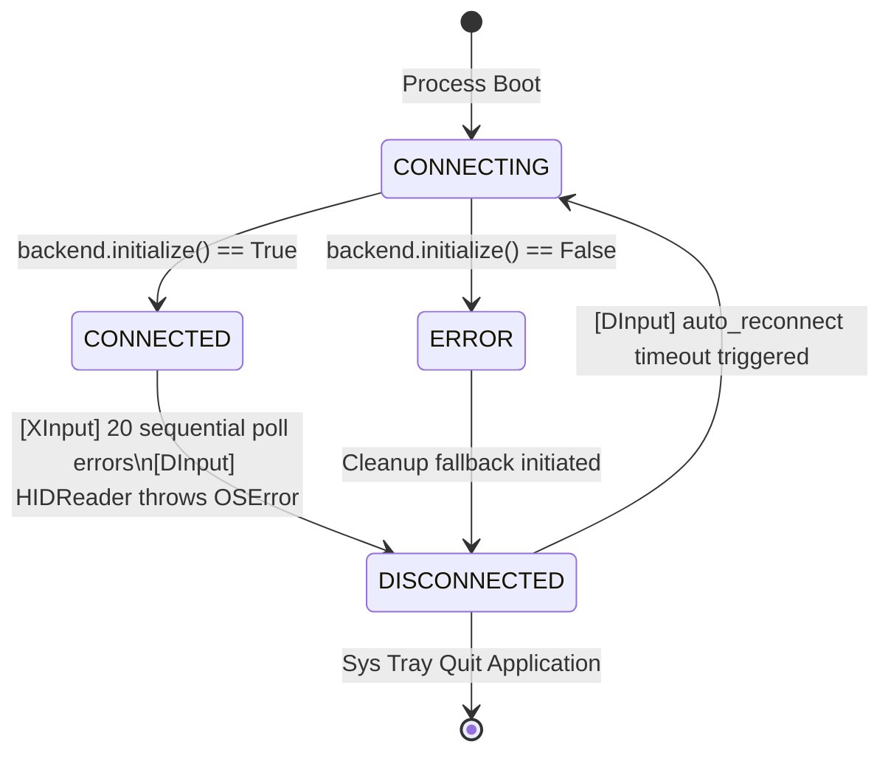
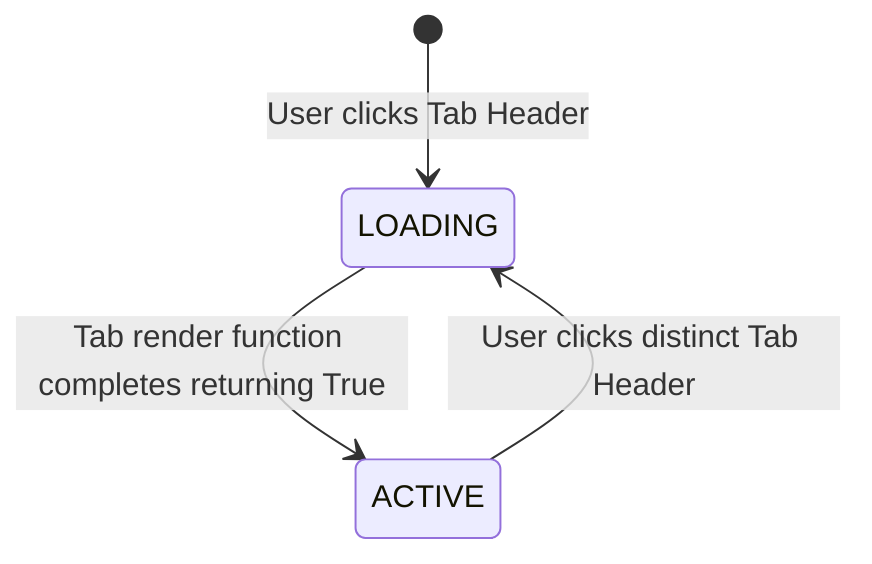
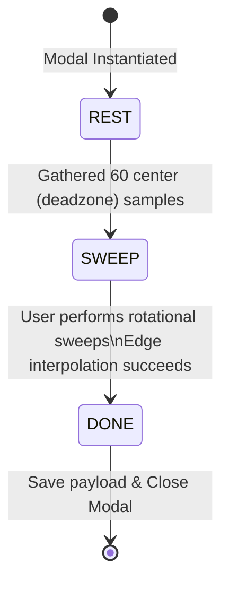
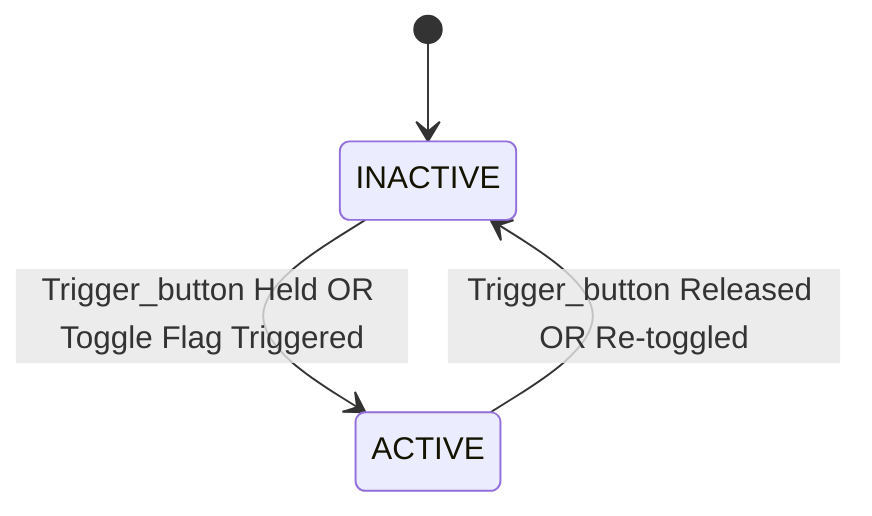

# SECTION 3: SYSTEM EVENT & STATE LISTENER DIRECTIVES

This section documents every asynchronous event stream, signal, callback, and communication channel operating within the system architecture. All components must strictly adhere to the defined communication protocols, payload schemas, and timing constraints.

## 3.1 UDP Telemetry Broadcast
- **Source Module**: `utilities_backend.py` -> `gui.py` / `input_graph.py`
- **Originating Function**: `LatencyMonitor.broadcast_state()` invoked within the `main.py` data handler callback context.
- **Protocol & Transport**: UDP datagrams.
- **Network Interface**:
  - **Broadcast Target**: `127.0.0.1` (localhost)
  - **Destination Port**: `9999`
- **Payload Schema**: JSON-encoded string representation of the `ControllerState` dataclass dictionary (`ControllerState.__dict__`).
  - **Encoding**: UTF-8.
  - **Fields**: Complete inclusion of all analog axis values (`float`, `-1.0` to `1.0`), trigger values (`float`, `0.0` to `1.0`), and button states (`bool`).
- **Transmission Frequency**: Dispatched on every poll cycle.
  - **XInput Backend**: ~500Hz fixed interval.
  - **DInput Backend**: Variable, dependent on underlying hardware polling capabilities (typically 125Hz - 1000Hz).
- **Consumer Registration Mechanism**:
  - The GUI application initializes a dedicated daemon thread via `start_hid_polling()`.
  - The inbound UDP socket is bound to address `0.0.0.0` on port `9999`.
  - Socket flag `SO_REUSEADDR` is explicitly set to `1` to prevent binding conflicts upon restarts.
- **Stale State & Fallback Handling**:
  - The consumer independently tracks receipt timestamps (`time.time()`).
  - **Condition**: If `(current_time - self.last_udp_time) > 1.0` seconds.
  - **Action**: The GUI listener flags the telemetry stream as stale and gracefully degrades to direct hardware polling mechanisms.

## 3.2 HID Reader Data Callback
- **Source Module**: `hid_reader.py` -> `backend_dinput.py`
- **Originating Function**: `HIDReader.start()` executes `self.callback(report)` for every contiguous HID packet successfully parsed from the hardware buffer.
- **Payload Schema**: `RawHIDReport` dataclass instance.
  - **Type**: Python Dataclass object.
  - **Data Range**: Unprocessed `uint8` byte arrays originating directly from the USB/BT endpoint.
- **Transmission Frequency**: Dictated strictly by controller firmware configurations and USB endpoint descriptor polling intervals (nominally 125Hz, 250Hz, 500Hz, or 1000Hz).
- **Consumer Registration Mechanism**:
  - During backend initialization, `backend.poll()` maps the reader instance callback via `reader.set_callback(target_function)`.
- **Thread Safety & Execution Context**:
  - Explicit daemon thread allocation per `HIDReader` instance. The callback executes within the context of the reader's isolated thread, necessitating thread-safe queueing or atomic state updates on the consumer end.

## 3.3 XInput Polling Callback
- **Source Module**: `backend_xinput.py` -> `main.py`
- **Originating Function**: `XInputBackend.poll()` synchronously retrieves API state and invokes `self.callback(cs)` passing the parsed `ControllerState`.
- **Payload Schema**: Standardized `ControllerState` dataclass instance.
- **Transmission Frequency**: Hardcoded 500Hz throttle constraint (`time.sleep(1.0 / 500.0)` enforced per iteration).
- **Consumer Registration Mechanism**:
  - `main.py` daemon bootstrap registers the top-level handler via `backend.set_callback(data_handler)`.

## 3.4 Force Feedback Notification Pipeline
- **Source Module**: `vgamepad` dependency -> `virtual_pad.py` -> `main.py`
- **Originating Function**: `ViGEmBus` subsystem relays force feedback requests via target process memory mapped hooks to `_vgamepad_notification_handler`.
- **Payload Schema**:
  - `large_motor`: Unsigned 8-bit integer (`uint8`, range `0-255`) for low-frequency rumble.
  - `small_motor`: Unsigned 8-bit integer (`uint8`, range `0-255`) for high-frequency rumble.
- **Forwarding Mechanism**:
  - The internal notification handler routes parameters to `rumble_callback(large_motor, small_motor)`, subsequently executing `backend.set_vibration()`.
- **Suppression Directives**:
  - **Condition**: Evaluates `haptic_engine.is_hijacked`.
  - **Action**: If `True`, the incoming ViGEmBus rumble request is silently discarded to allow procedural audio/haptic synthesis priority.

## 3.5 Configuration Hot-Reload Daemon
- **Source Module**: `main.py` -> `config_poller` thread.
- **Execution Context**: Background daemon thread.
- **Trigger Condition**: Polls `os.path.getmtime('config.ini')`.
- **Action on Trigger**:
  - Sequentially invokes reload vectors across system components:
    1. `mapper.reload_config()`
    2. `virtual_pad.reload_config()`
    3. `hardware_chord_engine.reload_config()`
- **Transmission Frequency**: Periodic file system polling (implementation-dependent sleep interval, typically 1.0s to 5.0s).

## 3.6 Diagnostics File Broadcast Channel
- **Source Module**: `utilities_backend.py` -> `gui.py`
- **Originating Function**: `LatencyMonitor.start_logging()` executes a blocking I/O write to `diagnostics.json`.
- **Payload Schema**: JSON object containing:
  - `polling_rate_hz`: `float`
  - `avg_process_ms`: `float`
  - `max_process_ms`: `float`
- **Transmission Frequency**: Fixed 500ms writing interval.
- **Consumer Mapping**: `gui.py` executes `update_utilities_loop()` which performs asynchronous reads of the file at 500ms intervals to update telemetry visuals.

## 3.7 Status File Broadcast Channel
- **Source Module**: `main.py` -> `gui.py`
- **Originating Function**: `write_status(status_str, device_str)` executes a blocking I/O write to `status.json`.
- **Payload Schema**: JSON object mapping:
  - `status`: `str` (Enum set: `['Connected', 'Disconnected', 'Connecting', 'Error']`)
  - `device`: `str` (Hardware identifier string or `null`)
- **Transmission Frequency**: Event-driven on state transition.
- **Consumer Mapping**: `gui.py` executes `update_status_loop()` reading the payload every 1000ms.

## 3.8 GUI Timer-based Polling Loops
All GUI polling loops utilize non-blocking after-callbacks or dedicated threading to prevent frame-blocking.

| Loop Identifier | Frequency | Interval (ms) | Data Source | Consumer Action |
|---|---|---|---|---|
| `update_position_loop` | 60Hz | ~16ms | `self.current_state` (Memory) | Updates joystick coordinates, trigger fill bars, and button highlights. |
| `update_utilities_loop` | 2Hz | 500ms | `diagnostics.json` (Disk) | Refreshes real-time statistics UI counters. |
| `update_status_loop` | 1Hz | 1000ms | `status.json` (Disk) | Alters UI connection pill color and text. |
| `LoadingSpinner.rotate` | 50Hz | 20ms | Local Step Counter | Updates frame index for loading animation rendering. |
| `CircularityCalibrationModal.update_loop` | 60Hz | ~16ms | `self.current_state` (Memory) | Records raw bounds vector data into memory for profile calculation. |

---

# SECTION 4: GUI STATE MACHINE & INITIALIZATION FLOW

This section governs the precise boot execution, teardown, and lifecycle state management of the background daemon and frontend GUI. 

## 4.1 Initialization Sequence (Daemon Process: `main.py`)
1. **Singleton Lock**: `ensure_single_instance('UR-XD', 49152)` — Attempts to bind a TCP socket to localhost:49152. Forcefully exits process with error code `1` if port is locked (indicating already running).
2. **CLI Parsing**: Evaluate `sys.argv` for `--debug` and `--append-log` modifiers.
3. **Configuration Boot**: `load_config('config.ini')` — Parses local INI structure into runtime dictionary.
4. **Logger Boot**: `setup_logger()` — Hooks stdout and file handlers based on log level settings.
5. **Community Profile Sync**: Checks relative time delta against `db_update_interval_days`. If elapsed, spawns synchronous `fetch_community_hid_maps()` REST operation.
6. **Hardware Enumerate**: Executes HID device scan resolving available USB/Bluetooth peripherals.
7. **Backend Dispatching**: Evaluates `config.backend.mode`. Resolves string literal (`'xinput'`, `'dinput'`, `'auto'`) to concrete class target.
8. **Backend Initialization**: Calls `backend.initialize()`. Captures return `bool` flag.
9. **Profile Mapping**: Creates `ControllerConfig` instance loading the per-device JSON schema path.
10. **Emulation Subsystem**: Instantiates `VirtualPad(config)` creating the `ViGEmBus` target for Xbox 360 pad emulation.
11. **Haptics Subsystem**: Instantiates `HapticEngine(virtual_pad)`.
12. **Macro Engine**: Instantiates `MacroExecutor(mapper)` executing a parser over `macros.json`.
13. **Chord Engine**: Instantiates `HardwareChordEngine(config)` allocating virtual registers for sequential combo detection.
14. **Translation Engine**: Instantiates `Mapper(config)`. Commences secondary background thread for mouse movement delta interpolation.
15. **Callback Wiring**: 
    - Executes `backend.set_callback(data_handler)`.
    - Executes `virtual_pad.set_rumble_callback(rumble_callback)`.
16. **Polling Loop Start**: Commences `backend.poll()` (synchronous blocking) OR `start_polling_thread()` (daemon threading), determined by backend concrete class requirements.
17. **Telemetry Start**: `monitor.start_logging()` commences disk write cycles.
18. **Hot-Reload Start**: Spawns `config_poller` daemon thread.
19. **System Tray Integration**: Instantiates `pystray.Icon` with context menu containing: `[Open Config, Show Console, Quit]`.
20. **State Broadcast**: Writes final state via `write_status('Connected', device_name)`.

## 4.2 Initialization Sequence (GUI Process: `gui.py`)
1. **Root Boot**: Executes `super().__init__()` initializing the `customtkinter` (CTk) top-level window.
2. **Window Parameters**: Injects window title string and parses geometry string `WxH` from configuration limits.
3. **Daemon Sync**: Executes `load_daemon_config()` reading `config.ini` directly to mirror state expectations.
4. **Profile Detection**: Parses `daemon_config[controller][last_profile]` to resolve current active hardware mapping file path.
5. **Config Schema Load**: Instantiates `ControllerConfig(hardware_profile_path)` to define UI element boundaries and capabilities.
6. **Integrity Check**: Executes `self.load_config()` to validate existence of critical configuration nodes.
7. **State Init**: Allocates `self.current_state = ControllerState()` with zeroed defaults.
8. **Tab Matrix Generation**:
    - `setup_dashboard()`
    - `setup_remapping()`
    - `setup_analog_tuning()`
    - `setup_advanced()`
    - `setup_utilities()`
    - `setup_customization()`
9. **UI Blocking**: Overrides default CTk tab switching functionality injecting the `LoadingOverlay` pseudo-widget to mask rendering stalls.
10. **Status Sync Loop**: Dispatches `update_status_loop()` on a 1Hz clock interval.
11. **Telemetry Handshake**: Dispatches `start_hid_polling()` spawning the background UDP listener server socket alongside fallback mechanisms.

## 4.3 Teardown Sequence (Daemon Process: `main.py`)
1. **Interrupt Vector**: `quit_app()` invoked asynchronously by OS messaging via `pystray` System Tray 'Quit' action.
2. **Icon Cleanup**: Executes `icon.stop()` clearing OS memory space and removing tray visual.
3. **State Broadcast**: Synchronously calls `write_status('Disconnected')` to inform any active GUI elements of impending closure.
4. **Process Termination**: Executes `sys.exit(0)`, dispatching `SIGKILL` equivalent to all bound daemon threads and finalizing script execution.

## 4.4 Teardown Sequence (GUI Process: `gui.py`)
- **Implicit Teardown**: Main `mainloop()` destruction cascades termination to standard Python processes. Daemon threads rely on Python interpreter garbage collection upon parent thread termination.
- **Explicit Modal Teardown**: Active `pynput` listener instances housed within macro recording or circularity calibration modals are guaranteed closure via explicit `try/except/finally` teardown invocations executing within `cancel_and_close()` destructors.

## 4.5 Global State Transition Diagrams

### Daemon State Machine (`main.py`)
State transitions are primarily governed by USB bus interrupts and logical validations.

### GUI Tab Lifecycle (`gui.py`)
Tab transitions utilize an overlay to prevent visual lockups during heavy `matplotlib` or UI render cycles.

### Circularity Calibration Modal States

### Shift Layer Trigger States

